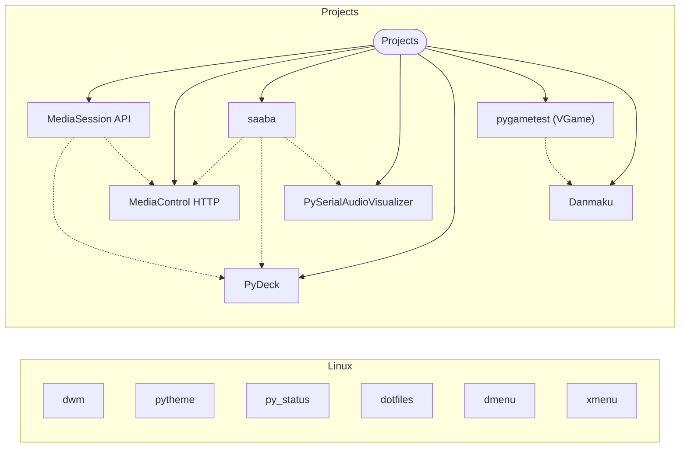
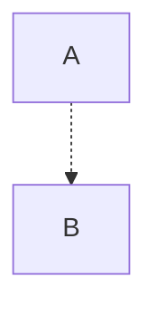

# Projects

Just my own repositories graph

_((cuz i forgor))_

blocks are clickable ⬇

_(use ctrl+click to open)_

```mermaid
flowchart LR

  subgraph Linux
  direction TB
    dwm["dwm"]
    py_theme["pytheme"]
    py_status
    dotfiles
    dmenu
    xmenu
  end

  subgraph Projects
    direction TB
    base(["Projects"])

    media_control["MediaControl HTTP"]
    media_session["MediaSession API"]
    audio_vis["PySerialAudioVisualizer"]
    saaba["saaba"]
    pydeck["PyDeck"]

    v_game["pygametest (VGame)"]
    danmaku["Danmaku"]

    click media_session href "https://github.com/virashu/media_session"
    click media_control href "https://github.com/virashu/mediacontrol"
    click audio_vis href "https://github.com/virashu/PySerialAudioVisualizer"
    click saaba href "https://github.com/virashu/saaba"
    click pydeck href "https://github.com/virashu/pydeck"
    click v_game href "https://github.com/virashu/pygametest"
    click danmaku href "https://github.com/virashu/danmaku"

    base --> media_session
    base --> media_control
    base --> saaba
    base --> audio_vis
    base --> pydeck

    base --> v_game
    base --> danmaku

    v_game -.-> danmaku
    saaba -.-> media_control
    saaba -..-> pydeck
    saaba -.-> audio_vis
    media_session -..-> pydeck
    media_session -.-> media_control
  end


```

---

```mermaid
flowchart TB

A -.-> B

```

This means that B depends on A

(Think of it like A 'included' in b)
