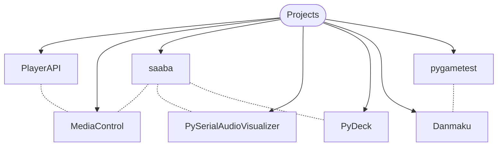

# Projects

Just my own repositories graph

*((cuz i forgor))*

blocks are clickable ⬇

```mermaid
flowchart
  base(["Projects"])

	player_api["PlayerAPI"]
	media_control["MediaControl"]
  audio_vis["PySerialAudioVisualizer"]
  saaba["saaba"]
  pydeck["PyDeck"]

	v_game["pygametest"]
	danmaku["Danmaku"]

  click media_control "https://github.com/virashu/media_control"
  click audio_vis "https://github.com/virashu/PySerialAudioVisualizer"
  click saaba "https://github.com/virashu/saaba"
  click pydeck "https://github.com/virashu/pydeck"
  click v_game "https://github.com/virashu/pygametest"
  click danmaku "https://github.com/virashu/Danmaku"

	base --> player_api
	base --> media_control
  base --> saaba
  base --> audio_vis
  base --> pydeck

	base --> danmaku
	base --> v_game

  v_game -.- danmaku
	player_api -.- media_control
  saaba -.- media_control
  saaba -.- audio_vis
  saaba -.- pydeck

```